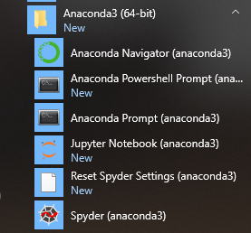
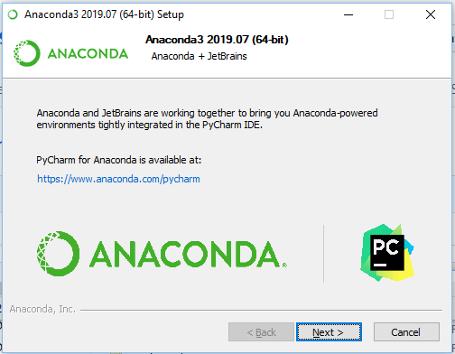

# Install


```
$ brew cask install anaconda
```

```
> choco install anaconda3 --version=2019.03
```


## Binaire

https://www.anaconda.com/distribution/


## Spyder




## PyCharm

https://www.anaconda.com/pycharm/


